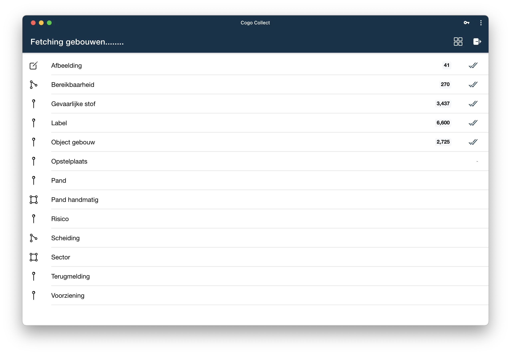
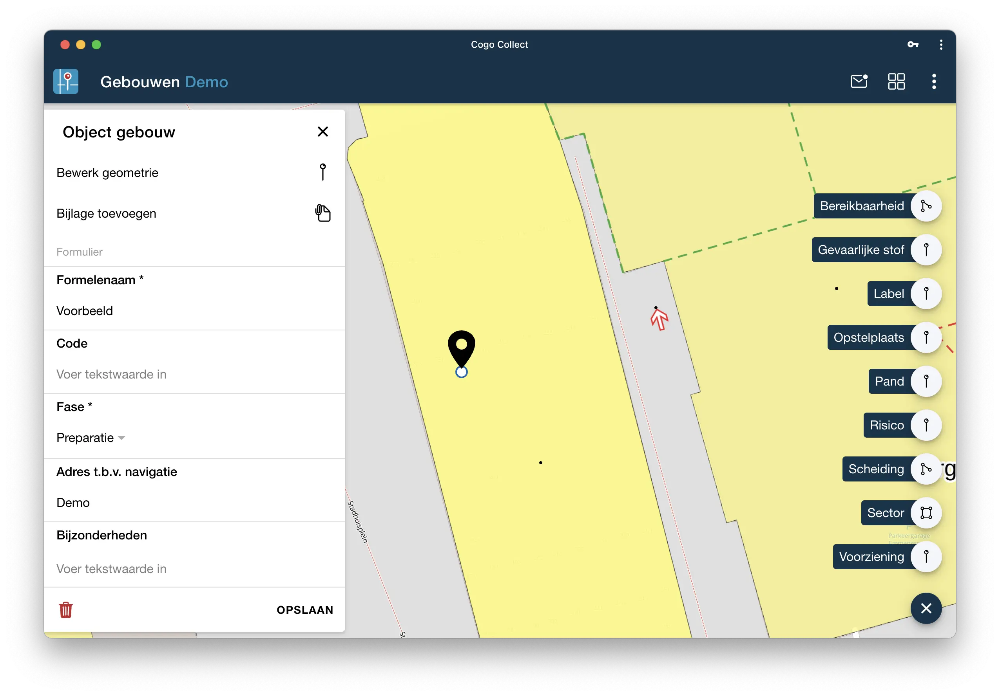
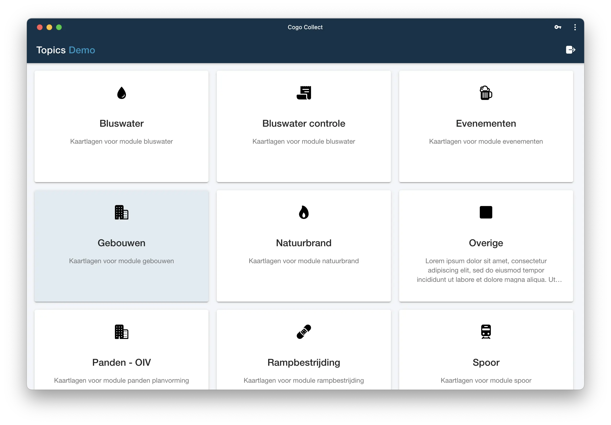

Een belangrijke update van  is deze week live gegaan! In deze update bouwen we verder op de basis die is
gelegd in versie 4. Wat is er precies veranderd?

## Single-Sign-On

Het login proces is aangepast zodat er op verschillende manieren geauthenticeerd kan worden. Dit maakt de weg vrij om te
kunnen koppelen met verschillende authenticatie providers
zoals [Azure Active Directory](https://azure.microsoft.com/nl-nl/) of [Keycloak](https://www.keycloak.org/). Dit
principe wordt Single
Sign-On (SSO) genoemd en hierdoor kunnen gebruikers met één paar inloggegevens inloggen op verschillende,
maar gerelateerde systemen of contactpunten. Vanaf elk apparaat, waar ze zich ook bevinden.

## Eenvoudiger navigeren



Er zijn een aantal aanpassingen gedaan om eenvoudiger te kunnen navigeren op de kaart. Bij grotere schermen komen
linksboven navigatie knoppen in beeld om in/uit te zoomen en naar de extent van de kaart te zoomen.

Door in de kaart op een cluster te klikken zoom je in op het gebied van dit cluster. Via de extent knop zoom je direct
weer terug naar het start scherm. Een makkelijke manier om direct naar het juiste
gebied te navigeren. De video geeft dit weer.

<--->





## Kaartlagen check



Nieuw is de kaartlagen check bij het openen van een topic. Wanneer alle gegevens zonder problemen zijn opgehaald start
het scherm direct door naar de kaart. Bij problemen blijft het scherm openstaan en toont de foutmelding van de kaartlaag
waar iets mee aan de hand is. De check zorgt er voor dat er twee zaken beter zijn geregeld:

- Alle data van het topic is gegarandeerd opgehaald van de GIS server en klaar voor offline gebruik
- Het is direct zichtbaar welke kaartlagen niet werken. Via het rode uitroepteken kan de foutmelding worden opgehaald
  voor de GIS beheerder.

<--->



## User Interface verbeteringen

Er zijn een aantal User Interface (UI) verbeteringen doorgevoerd. De eerste is een aanpassing zodat het toevoegen van
punten, lijnen of vlakken aan een hoofdobject altijd rechtsonder te vinden. Hierdoor is de centrale plek om nieuwe
objecten aan te maken altijd rechtsonder. De tweede is een aantal verbeteringen voor grotere schermen. Zo is het
overzicht van de topics op een iPad of groter tegels in plaats van een lijst.



<--->



## Bug fixes

Tot slot zijn een aantal bugs verholpen. Vanaf versie 4 worden foutmeldingen automatisch naar ons verstuurd, op deze
manier kunnen we veel bugs oplossen zonder dat dit expliciet moet worden gemeld. De melding 'Failed to execute
transaction on IDBDatabase' is hierdoor nu verleden tijd. Het herladen van topics ging ook niet altijd goed, dit gaat nu
automatisch wanneer de gebruiker teruggaat naar het overzicht.

Wil je continu op de hoogte blijven van de laatste ontwikkelingen? Dan is het handig om
deze [LinkedIn](https://www.linkedin.com/groups/12294389/) groep te volgen.
