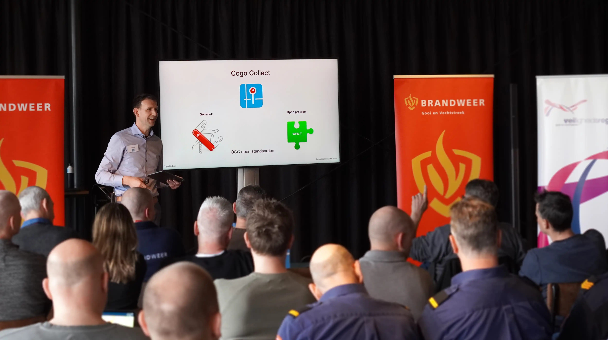

Op 14 maart vond de allereerste gebruikersbijeenkomst van Cogo Collect plaats. Het evenement werd georganiseerd in
samenwerking met Veiligheidsregio Flevoland en Gooi- & Vechtstreek, en richtte zich op gebruikers van ROI (Repressieve
Object Informatie). De bijeenkomst vond plaats op Lelystad Airport, in het Aviodrome.

Het programma begon met een algemene presentatie over Cogo Collect. Tijdens deze presentatie werden de belangrijkste
functies uitgelegd en werden tips & tricks gedeeld. Na de pauze was er een sessie over ROI, specifiek gericht op de
deelnemers. Tijdens de tweede sessie was er gelegenheid om ervaringen en wensen uit te wisselen rondom de applicatie.

De belangrijkste hyperlinks van deze ochtend nogmaals in een overzicht:

* [Cogo Collect documentatie](https://docs.cogocollect.nl)
* [Cogo Collect repository](https://github.com/cogocollect)
* [ROI datamodel](https://imroi.github.io/datamodel/)
* [ROI symbolen](https://github.com/imroi/kaartsymbolen/) en de [preview symbolen](https://imroi.github.io/kaartsymbolen/)

De sheets van de presentatie zijn te downloaden via deze link: [cc_gebruikersdag_roi_2023.pdf](cc_gebruikersdag_roi_2023.pdf)

De ochtend werd afgesloten met een lunch en een spectaculaire demonstratie van de luchthavenbrandweer van Flevoland
Airport.

We kijken terug op een zeer positieve ochtend en willen alle bezoekers bedanken voor hun constructieve bijdrage. Met
deze input kunnen wij verder ontwikkelen en zorgen voor een optimale aansluiting op nieuwe klantbehoeften.